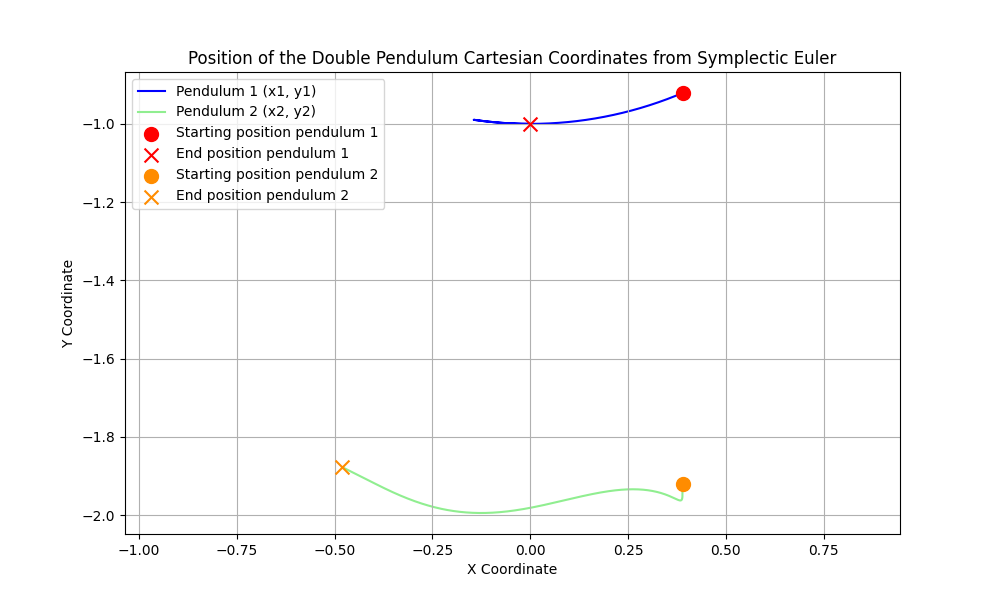
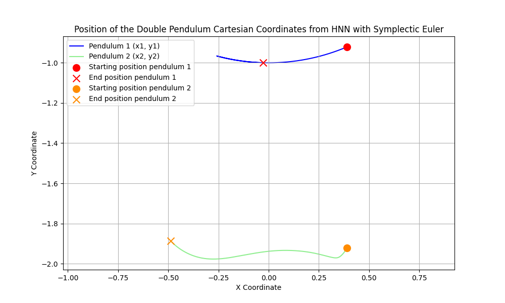
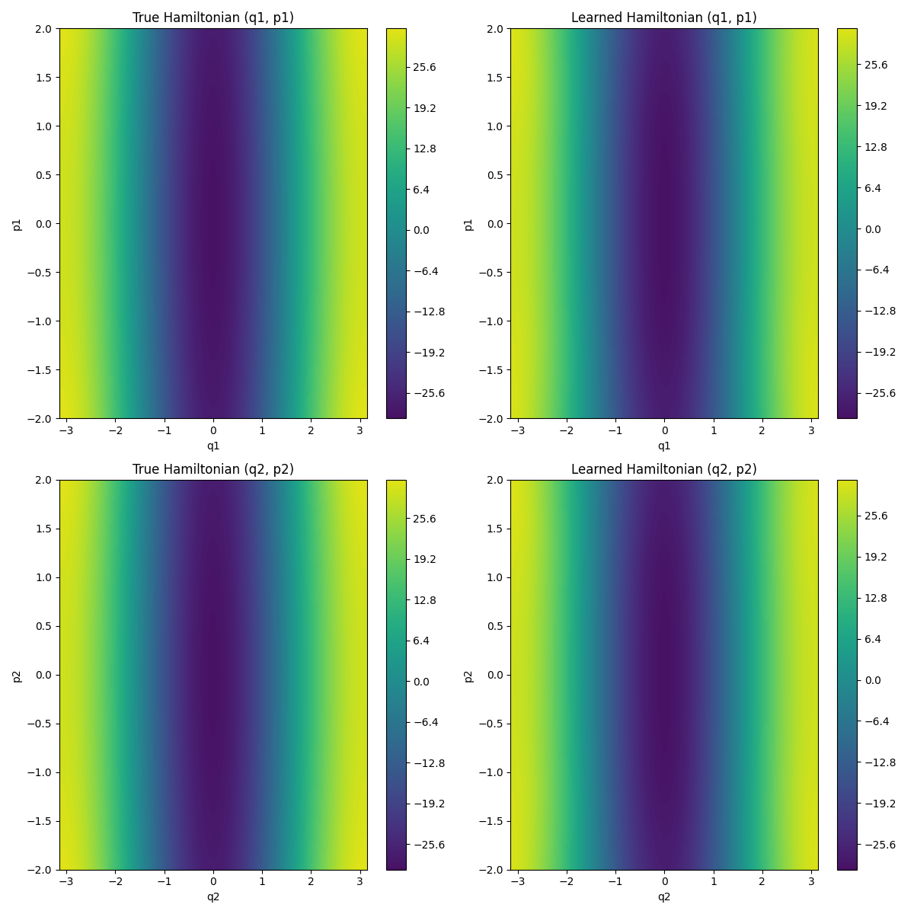

# Hamiltonian Neural Networks for Single and Double Pendulum

This repository contains code for the simulation of a single and double pendulum with numerical solvers and learning of the Hamiltonian system with a Hamiltonian Neural Network. 
The code is based on the papers from [Greydanus et. al (2019)](https://arxiv.org/abs/1906.01563v1) 
and [Eichelsdörfer et. al (2021)](https://arxiv.org/pdf/2111.10329).

The goal is to learn neural networks which can be used to predict the trajectory of a single and double pendulum. 
Like in this case where the prediction of the numerical integration of the true, underlying Hamiltonian corresponds 
nicely to the learned Hamiltonian:

